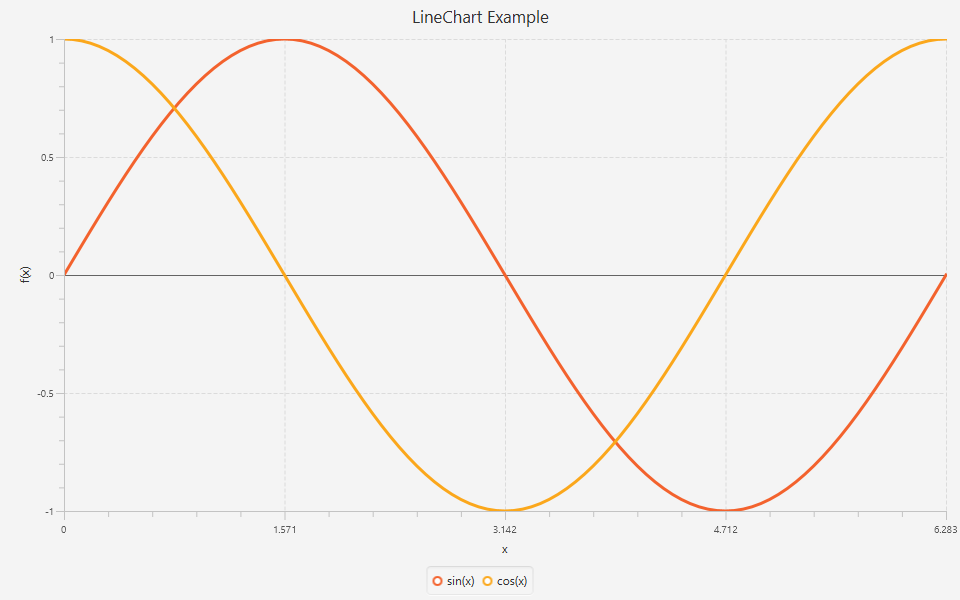
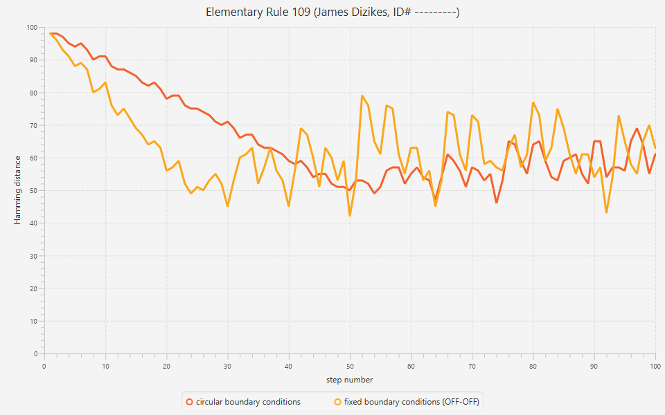
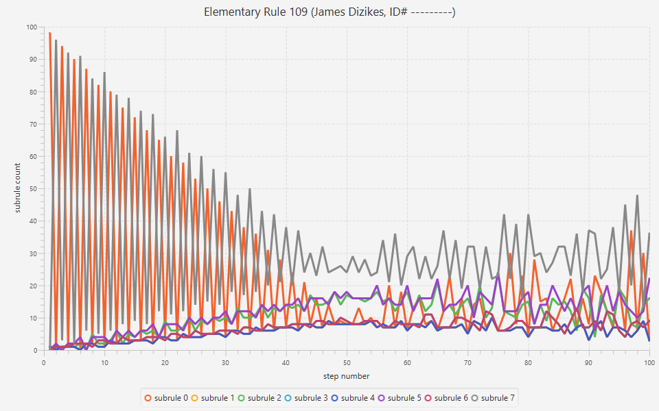

# Project 3: Visualizing Automaton Evolution

> Graphical excellence is that which gives to the viewer the greatest number of ideas in the shortest time with the least ink in the smallest space.
>
> &mdash;[Edward Tufte](https://en.wikipedia.org/wiki/Edward_Tufte), in *The Visual Display of Quantitative Information*

## Introduction

In Project 2, we wrote a utility class named `AutomatonMeasurements` to calculate quantities that describe cellular automaton evolution.
This class includes the following two methods:

1. `int[] hammingDistances(Automaton a)`: Given an Automaton that has evolved some number of steps, return an array of the Hamming distances between each successive Generation.
(The length of the array is equal to the number of steps.)

2. `int[][] subruleCounts(Automaton a)`: Given an Automaton that has evolved some number of steps, return an array of arrays with the number of times each subrule was used to produce each Generation. 
(The length of the array is equal to the number of steps, and the length of each subarray is equal to the number of subrules.)

In this short project, you will use these methods along with the rest of your Project 2 code to calculate Hamming distance and subrule count data for a particular elementary cellular automaton.
Then you will plot this data using the [JavaFX](https://en.wikipedia.org/wiki/JavaFX) graphics library.

## Installing JavaFX

JavaFX is the standard way to create a graphical user interface (GUI) in Java.
It is the successor to the [Abstract Window Toolkit](https://en.wikipedia.org/wiki/Abstract_Window_Toolkit) (AWT) and [Swing](https://en.wikipedia.org/wiki/Swing_(Java)) libraries and, unlike them, has classes for plotting data.

JavaFX used to be integrated with the JDK, but in 2018 Oracle decided to make it a standalone module.
This means that we have to download and manually include it in the build path of our Eclipse project, which is a bit of a chore.
The instructions in this section will show you how this is done.

These instructions are largely taken from [this site](https://openjfx.io/openjfx-docs/), which you may want to visit if you use an IDE other than Eclipse.
You can find instructions for IntelliJ and NetBeans by clicking on the links on the left side of the page.
The instructions below are based on those for a [non-modular Eclipse project](https://openjfx.io/openjfx-docs/#IDE-Eclipse).

### Download JavaFX

The standalone JavaFX module is hosted by the company Gluon on [this page](https://gluonhq.com/products/javafx/).
Download the JavaFX 11 SDK (not the jmods) for your operating system.

The SDK will be downloaded as a zip file.
Extract the contents of the file to a convenient location on your computer.
On my Windows desktop, for example, I extracted them to the same folder where the JDK is stored.
This creates the following folder: `C:\Program Files\Java\javafx-sdk-11.0.2`.

### Add the JavaFX Library to Eclipse

In Eclipse, click **Window** in the menu bar and then select **Preferences** to open the preferences window.
In the menu on the left side of the window, click the triangle next to **Java** and then **Build Path**.
Select **User Libraries** from the list.

The right side of the window should now show a list of user libraries, which is probably empty.
Click the **New...** button and input `JavaFX11` in the window that appears.
(Pretend the pictures below say `11` instead of `12`.)
Do not check the system library box.
Click **OK** to add the name to the list of user libraries.


Select **JavaFX11** from the list.
Click the button labeled **Add External JARs...** and navigate to the location where you extracted the SDK.
Open the `lib` folder and you should see a bunch of jar files that all begin with the text `javafx` (e.g., `javafx.base.jar` and `javafx.controls.jar`).
Select all of the jar files by clicking on the first, holding shift, and then clicking on the last.
(Do not select the file `src.zip`.)
Click **Open** to add the jars to the user library.


Click **Apply and Close** to close the preferences window.

### Add JavaFX to the Build Path

If you have not done so already, clone this repo to your computer and open it in Eclipse.
(To open the project, click **File** in the menu bar and then select **Open Projects from File System...**.)

Now open the source file `LineChartExample.java`.
Notice that all of the JavaFX import statements are underlined in red.
This is because Eclipse does not know where to find these classes.
To fix the problem, we need to add JavaFX to the build path.

Right-click the project folder in the package explorer window.
In the dropdown menu, hover on **Build Path** and then select **Configure Build Path...**.
This opens the properties window for the project.

On the right side of the window, click the **Libraries** tab.
Select **Classpath** from the list below the text **Jars and class folders on the build path**, and click the **Add Library...** button.
In the window that appears, select **User Library** and then click the **Next** button.
Check the box next to **JavaFX11** and click **Finish**.

Click **Apply and Close** to close the properties window.
If you followed these steps correctly, the JavaFX11 library will appear in the package explorer along with the JRE System Library, and the import statements in the source file will no longer be underlined.

### Add a Run Configuration

Run the source file `LineChartExample.java`.
The program will compile, but you will receive the following console message:

```
Error: JavaFX runtime components are missing, and are required to run this application
```

To fix this, we need to pass a couple of arguments to the Java virtual machine so it knows where to find the JavaFX module.

Right-click the source file in the package explorer.
In the dropdown menu, hover on **Run As** and then select **Run Configurations...**.
This opens the run configurations window.

On the right side of the window, click the **Arguments** tab.
In the **VM arguments** box, add the following text:

```
--module-path "<path-to-javafx-lib-folder>" --add-modules javafx.controls,javafx.fxml
```

Replace `<path-to-javafx-lib-folder>` with the path to the folder containing the JavaFX jar files.
For instance, on my Windows machine, these are the correct VM arguments:

```
--module-path "C:\Program Files\Java\javafx-sdk-11.0.2\lib" --add-modules javafx.controls,javafx.fxml
```

Note that Windows file paths use backslashes while macOS file paths use forward slashes.


Click **Apply** and then **Run** to close the run configurations window and run the program.
If you input the arguments correctly, a window will appear showing the plot below.



## Plotting Automaton Data

Congratulations, you just ran your first JavaFX application!

To complete the project, you will adapt the code in `LineChartExample.java` to plot some cellular automaton data.
First, however, you need to generate the data.

There are quite a few [interesting elementary rules](https://en.wikipedia.org/wiki/Cellular_automaton#Classification), so rather than have everyone plot the same data, we will assign rule numbers based on OU IDs.

### Calculate Your Rule Number

To determine your elementary rule number for this project, take your nine-digit OU ID number and calculate the remainder when divided by 43.
That is, calculate your ID number modulo 43.
Then find the corresponding rule number in this table:

| ID % 43 | Rule |
|:--:|:---:|
|  0 |  18 |
|  1 |  22 |
|  2 |  26 |
|  3 |  30 |
|  4 |  45 |
|  5 |  57 |
|  6 |  60 |
|  7 |  62 |
|  8 |  73 |
|  9 |  75 |
| 10 |  82 |
| 11 |  86 |
| 12 |  89 |
| 13 |  90 |
| 14 |  99 |
| 15 | 101 |
| 16 | 102 |
| 17 | 105 |
| 18 | 110 |
| 19 | 118 |
| 20 | 124 |
| 21 | 126 |
| 22 | 129 |
| 23 | 131 |
| 24 | 135 |
| 25 | 137 |
| 26 | 145 |
| 27 | 146 |
| 28 | 149 |
| 29 | 150 |
| 30 | 153 |
| 31 | 154 |
| 32 | 161 |
| 33 | 165 |
| 34 | 167 |
| 35 | 169 |
| 36 | 181 |
| 37 | 182 |
| 38 | 193 |
| 39 | 195 |
| 40 | 210 |
| 41 | 218 |
| 42 | 225 |

For example, suppose my ID number is `113123456`.
I can calculate my ID number modulo 43 in Java like this:

```java
int id = 113123456;
System.out.println(id % 43);
```

The result is 2, which corresponds to rule 26 in the table.
So I would use elementary rule 26 in the following sections.

### Generate the Data

Using your Project 2 code, create two elementary cellular automata with the rule number you calculated in the previous section.
One of the automata will use circular boundary conditions and the other will use OFF-OFF fixed boundary conditions.
Both automata will have the same initial generation: 101 cells with only the center cell in the ON state.

Evolve both automata 100 steps and then create the following data files:

1. Save the history of each automaton in a text file (i.e., the output of the `getHistory` method).
The files should be named `elementary<rule-num>-100steps-circularbc.txt` and `elementary<rule-num>-100steps-fixedbc-off-off.txt`, where `<rule-num>` is replaced with your rule number.

2. Calculate the Hamming distance versus the step number for each automaton using the `hammingDistances` method.
Save the data in two text files named `hamming-elementary<rule-num>-circularbc.txt` and `hamming-elementary<rule-num>-fixedbc-off-off.txt`.
The files should have a single distance on each line.

3. Calculate the subrule counts versus the step number for the automaton with circular boundary conditions using the `subruleCounts` method.
Save the data in a text file named `subrules-elementary<rule-num>-circularbc.csv`.
The file should store the data of each subarray on a separate line with the subrule counts separated by commas.

Commit all of these files to the `data` folder of your Project 3 GitHub repo.
(You do not need to commit any of your Project 2 code, only the data files.)
Example data files for elementary rule 109 are included in the folder to clarify these instructions.

### Plot the Data

Make two copies of the source file `LineChartExample.java` and name them `HammingPlot.java` and `SubrulesPlot.java`.
Adapt the example code to create two plots:

1. A plot of the Hamming distance data for both automata.
The x-axis shows the step number, and the y-axis shows the Hamming distance.
Save the plot to a file named `hamming-elementary<rule-num>.png`.

2. A plot of the subrule count data for the automaton with circular boundary conditions.
The x-axis shows the step number, and the y-axis shows the subrule count.
Save the plot to a file named `subrules-elementary<rule-num>-circularbc.png`.

Commit your code and image files to the `src` and `plots` folders of your GitHub repo respectively.
Example images for elementary rule 109 are included in the `plots` folder and are shown below.
Give your plots the same axis and data labels as in the examples, and include your rule number, name, and ID number in the plot titles.





Note: You do not need to plot the data in your history text files.
We are asking you to generate these files so you can check the output of your Project 2 code.
Compare the history of your automaton with circular boundary conditions to the corresponding image on [this site](https://plato.stanford.edu/entries/cellular-automata/supplement.html) to ensure it is correct.
